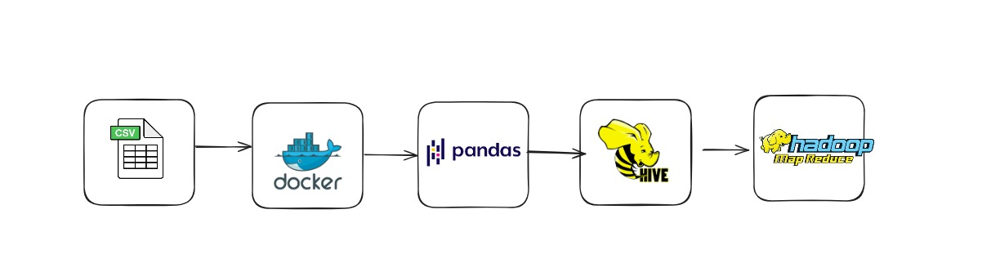

# 🏥 Big Data Healthcare Pipeline - MIMIC-III Dataset

> **A scalable big data pipeline for healthcare analytics using MIMIC-III clinical data with Hadoop ecosystem components**

---

## 🎯 Purpose
This project implements an end-to-end **big data pipeline** for processing and analyzing the MIMIC-III Clinical Database.The pipeline involves data cleaning using **Pandas**, conversion to **Parquet** format, storage in a containerized **HDFS** environment, and analysis using Apache **Hive**.

---

## 🎯 Objectives
1. Implement distributed storage of MIMIC-III data using HDFS
2. Perform batch analytics with Hive for clinical insights
3. Demonstrate parallel processing with MapReduce
4. Containerize the big data environment using Docker
5. Generate healthcare analytics on:
   - Patient length of stay prediction
   - ICU readmission risk analysis
   - Demographic-based mortality rates
   - Diagnosis-related treatment patterns

---

## ⚙️ Key Components & Technologies
| Component | Technology | Purpose |
|-----------|-------------|---------|
| **Distributed Storage** | Hadoop HDFS | Scalable data storage |
| **Batch Processing** | Apache Hive | SQL-based analytics |
| **Data Processing** | MapReduce | Parallel computation |
| **Containerization** | Docker | Environment packaging |
| **Data Format** | Parquet | Columnar storage optimization |
| **Version Control** | Git/GitHub | Code management |

---

## 🏗️ System Architecture

  
  
<em>Complete data pipeline from MIMIC-III dataset to healthcare insights</em>

## 📁 Project File Structure

📁 (Project Root)/
├── 📄 README.md                   # Main project documentation
├── 📂 DOC/                        # Documentation and outputs
│   ├── 📄 Architechture.jpg       # System architecture diagram
│   └── 📄 USER_MANUAL.pdf         # User manual for the pipeline
│
├── 📂 Data/                       # All data assets
│   ├── 📂 processed-data/         # Cleaned and processed data
│   │   ├── 📄 Admissions.csv
│   │   ├── 📄 CUSTAYS.csv
│   │   ├── 📄 CUSTAYS.parquet
│   │   ├── 📂 admissions_parquet/     # Parquet-formatted data
│   │   ├── 📂 diagnoses_lcd_parquet/  # Parquet-formatted data
│   │   ├── 📄 patients.csv
│   │   └── 📄 patients.parquet
│   │
│   └── 📂 raw-data/               # Original source data
│       ├── 📄 ADMISSIONS.csv
│       ├── 📄 DIAGNOSES_ICD.csv
│       ├── 📄 CUSTAYS.csv
│       ├── 📄 LICENSE.txt
│       ├── 📄 PATIENTS.csv
│       └── 📄 SHA256SUMS.txt
│
├── 📂 hive/                       # Hive-related files
│
├── 📂 hive-queries/               # Hive query scripts
│   └── 📄 hive-queries.txt
│
├── 📂 hive-table/                 # Table creation scripts
│   └── 📄 create_table.txt
│
├── 📂 MapReduce/                  # MapReduce components
│
├── 📂 avg_classes/                # MapReduce implementation
│   ├── 📄 AverageAge$AgeMapper.class
│   ├── 📄 AverageAge$AverageReducer.class
│   ├── 📄 AverageAge.class
│   ├── 📄 AverageAge.java         #MapReduce java script
    ├── 📄 part-r-00000            #MapReduce output
│   └── 📄 average_age.jar
│
└── 📂 python/                     # Data processing scripts
    ├── 📄 ICUstays.ipynb          # Jupyter notebook for ICU stays
    ├── 📄 admission.ipynb         # Jupyter notebook for admissions
    ├── 📄 clean.py                # Data cleaning script
    ├── 📄 diagnoses.ipynb         # Jupyter notebook for diagnoses
    └── 📄 patients.ipynb          # Jupyter notebook for patients           
